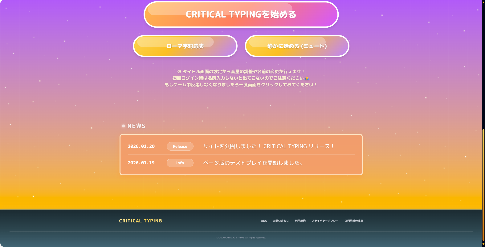

# ⭐ CRITICAL TYPING - タイピングゲーム & ランディングページ ⭐

未経験からエンジニアを目指して開発した、オリジナルのタイピングゲームおよびその紹介サイト（LP）です。
企画・デザイン・開発から、Vercel を使用した独自ドメインでの公開までを約1週間で行いました。

**🔗 公開URL / リポジトリ**
| Type | URL | Source Code (GitHub) |
| :--- | :--- | :--- |
| **LP (Main)** | [https://criticaltyping.com](https://criticaltyping.com) | **Current Repository** |
| **Game App** | [https://typing-game-eta-lime.vercel.app](https://typing-game-eta-lime.vercel.app) | [**👉 ゲーム本体のコードはこちら**](https://github.com/mori-3-desu/Typing-game) |

  
  

## プロジェクトとプロダクトの概要

本リポジトリは、自作タイピングゲーム **「CRITICAL TYPING」** の集客・紹介を目的としたランディングページ（LP）のソースコードです。

### ゲーム概要 
**「楽しみながらタイピングスキルを向上させる」** をテーマにしたWebアプリケーションです。
BackSpaceでの修正を必須とすることで速度ではなく **「正確性」** を重視。ミスをしなければ制限時間が回復し、長く遊べるゲームシステムを採用しました。

## 使用技術

本プロジェクトでは、**LP（集客・SEO）** と **ゲームアプリ（動作・体験）** で役割を明確に分け、それぞれに最適な技術を選定しました。

| Category | Technology | Context / Reason for Adoption |
| :--- | :--- | :--- |
| **Frontend (LP)** | **Next.js (React)** | SEO対策 (SSG/SSR) 、OGP設定、画像最適化によるパフォーマンス向上を重視して採用。 |
| **Frontend (Game)** | **Vite + React** | オーバーヘッドが少なく、複雑なロジックの実装に強い。HMRによる開発効率向上のため採用。|
| **Language** | **TypeScript** | 静的型付けによるバグの早期発見、およびコードの堅牢性、保守性の担保。 |
| **Backend / DB** | **Supabase** | ゲーム内のランキング機能（データ保存・リアルタイム取得）および匿名認証に使用。 |
| **Styling** | **Tailwind CSS** | 「ユーティリティファーストによる開発速度向上と、デザインの一貫性確保」。アニメーションはCanvas/CSS3を使用。 |
| **Infrastructure** | **Vercel** | GitHub連携によるCI/CDパイプラインの自動化。Next.jsとの親和性が高く、設定ゼロで高速デプロイが可能。 |
| **Domain** | **Vercel** | 独自ドメイン (`criticaltyping.com`) の取得・管理を一元化し、SSL証明書の自動更新を活用。 |
| **Form** | **Google Forms** | お問い合わせ機能に使用。iframe埋め込みにより、個人情報管理のリスクを分離・低減。 |

## こだわりポイント・技術的な挑戦

### 1. 目的別のアーキテクチャ分離
「集客用のLP」にはSEOに強い **Next.js** を、「ゲーム本体」には動作の軽い **Vite** を採用しました。
異なるフレームワークを組み合わせることで、それぞれのメリットを最大限に活かしつつ、Vercelのrewrites機能（またはリンク遷移）でユーザーに違和感のないUXを提供しています。

### 2. UXを意識した設計
LPではユーザーの興味を惹きつけるため、CSSアニメーションを多用しています。
ファーストビューでのインパクトや、スクロールに合わせた心地よい動きを意識し、Tailwind CSSの設定を拡張して実装しました。

### 3. セキュリティと保守性
- **TypeScriptの全面採用:** 型安全性による堅牢なコードベースを構築。
- **リスク分離:** フォーム機能を外部化し、サーバーサイドでのセキュリティリスクを構造的に排除しました。

## 今後の展望

- **AWSへの移行検討:** インフラ構築の学習として、現在のVercel環境から AWS (S3 + CloudFront + Route53) への移行構成を検討中。
- **OSS活動:** 自作したCSSアニメーションをライブラリ化し、オープンソースとして公開する計画があります。

- **Qiita:** [https://qiita.com/mori-3-desu]
- **GitHub:** [https://github.com/mori-3-desu]