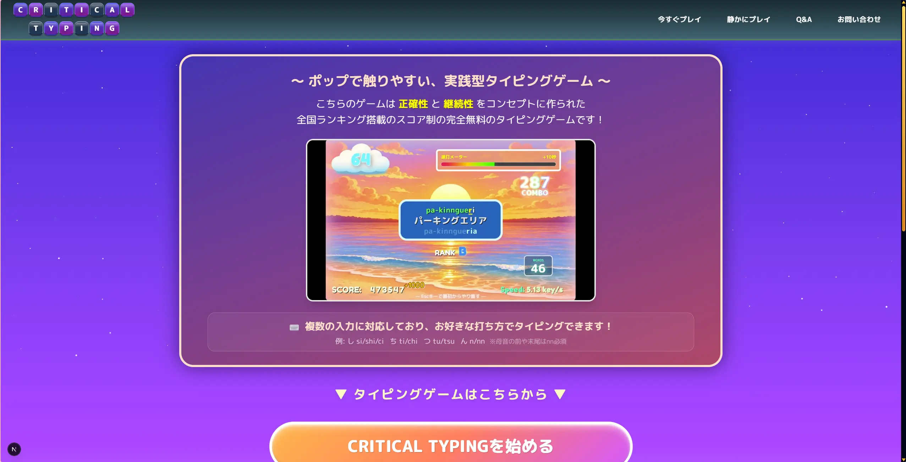
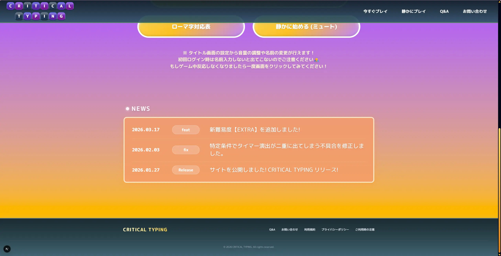

# ⭐ CRITICAL TYPING - Landing Page ⭐

未経験からエンジニアを目指して開発した、オリジナルのタイピングゲームおよびその紹介サイト（LP）です。
企画・デザイン・開発から、Vercel を使用した独自ドメインでの公開までを約1週間で行いました。

**🔗 公開URL / リポジトリ**
| Type | URL | Source Code (GitHub) |
| :--- | :--- | :--- |
| **LP (Main)** | [https://criticaltyping.com](https://criticaltyping.com) | **Current Repository** |
| **Game App** | [https://criticaltyping.net](https://criticaltyping.net) | [**👉 ゲーム本体のコードはこちら**](https://github.com/mori-3-desu/Typing-game) |

  
  

## プロジェクトとプロダクトの概要

本リポジトリは、自作タイピングゲーム **「CRITICAL TYPING」** の集客・紹介を目的としたランディングページ（LP）のソースコードです。

### ゲーム概要

**「楽しみながらタイピングスキルを向上させる」** をテーマにしたWebアプリケーションです。
BackSpaceでの修正を必須とすることで速度ではなく **「正確性」** を重視。ミスをしなければ速度を優先して正確性を犠牲にした時よりもスコアが伸びやすくなる計算システム、コンボ制と連打ゲージで制限時間が回復するシステムを導入し、長く遊べるゲームシステムを採用しました。

## 使用技術

本プロジェクト（LP）で使用している技術スタックです。

| Category               | Technology            | Context / Reason for Adoption                                                                                     |
| :--------------------- | :-------------------- | :---------------------------------------------------------------------------------------------------------------- |
| **Frontend**           | **Next.js (React)**   | SEO対策 (SSG/SSR)、OGP設定、画像最適化によるパフォーマンス向上を重視して採用。                                    |
| **Language**           | **TypeScript**        | 静的型付けによるバグの早期発見、およびコードの堅牢性・保守性の担保。                                              |
| **Styling**            | **Tailwind CSS**      | ユーティリティファーストによる開発速度向上と、デザインの一貫性確保。アニメーションはCSS3を使用。                  |
| **Animation**          | **Framer Motion**     | オープニングのカーテンアニメーションに使用。宣言的なAPIでアニメーションを管理。                                   |
| **Validation**         | **Zod**               | 環境変数のスキーマバリデーションに使用。型安全な環境変数アクセスを実現。                                          |
| **Linter / Formatter** | **ESLint / Prettier** | コード品質の担保と、importの自動ソートを含むフォーマットの統一。                                                  |
| **Infrastructure**     | **Vercel**            | GitHub連携によるCI/CDパイプラインの自動化。Next.jsとの親和性が高く、独自ドメイン管理・SSL証明書の自動更新も活用。 |
| **Form**               | **Google Forms**      | お問い合わせ機能に使用。iframe埋め込みにより、個人情報管理のリスクを分離・低減。                                  |

## こだわりポイント・技術的な挑戦

### 1. 目的別のアーキテクチャ分離

「集客用のLP」にはSEOに強い **Next.js** を、「ゲーム本体」には動作の軽い **Vite** を採用しました。
異なるフレームワークを組み合わせることで、それぞれのメリットを最大限に活かしつつ、Vercelのrewrites機能（またはリンク遷移）でユーザーに違和感のないUXを提供しています。

### 2. シンプルかつゲーム感を意識した設計

LPとして重いアニメーションの多用を避けつつ、リッチに見えるデザインを意識しました。ゲーム感を演出するため、ロゴの部分はキーボード風のデザインにしてタイピングゲームであることを直感的に伝えるようにしています。ボタンやスクロールバーのデザインを自作し、操作したくなるUIと、インタラクションに自然に反応するUXを目指しました。

### 3. セキュリティと保守性

- **TypeScriptの全面採用:** 型安全性による堅牢なコードベースを構築。
- **リスク分離:** フォーム機能を外部化し、サーバーサイドでのセキュリティリスクを構造的に排除しました。
- **セキュリティヘッダーの設定:** middlewareでCSP・HSTS・X-Frame-Optionsなどのセキュリティヘッダーを一括設定。CSPはNext.js 16のnonce自動付与非対応を受け`unsafe-inline`で妥協しているが、外部ドメインからのスクリプト読み込み禁止は維持しXSS対策を確保。

## 今後の展望

- **AWSへの移行検討:** インフラ構築の学習として、現在のVercel環境から AWS (S3 + CloudFront + Route53) への移行構成を検討中。
- **bfcache対応の根本解決:** 現在、ブラウザの戻る操作時に `pageshow` イベントで `location.reload()` を呼ぶ**回避策**を採用しています。これはbfcacheによるアニメーション状態の不整合を防ぐための暫定対応であり、bfcacheの恩恵（瞬時の復元）を意図的に無効化しています。根本的には `Cache-Control: no-store` ヘッダーの設定、もしくはアニメーション状態管理をbfcacheと共存できる設計へ刷新することが望ましいです。

- **Qiita:** [https://qiita.com/mori-3-desu]
- **GitHub:** [https://github.com/mori-3-desu]
